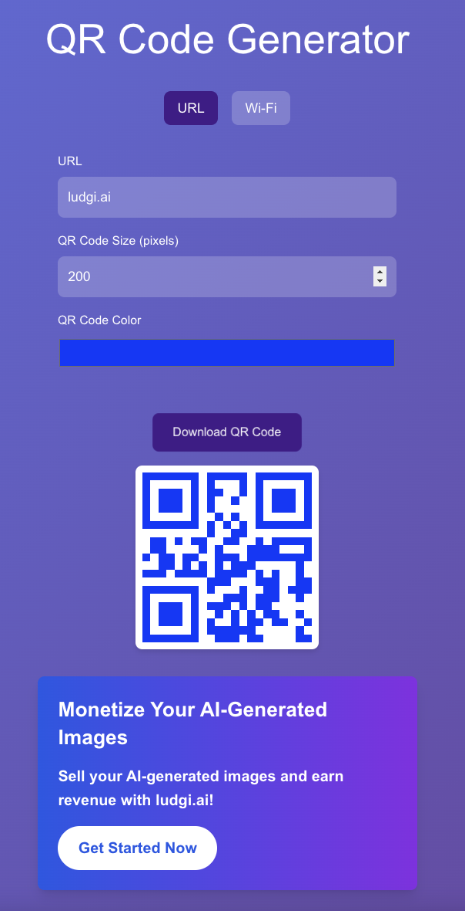
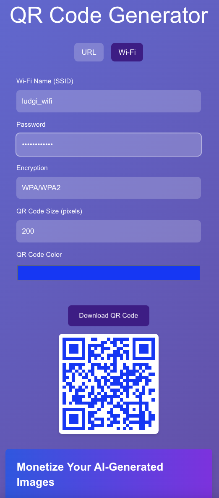

# QR Code Generator

# deploy

- ref: [https://qrgen.ludgi.ai](https://qrgen.ludgi.ai)

# sitemap

- ref: [https://qrgen.ludgi.ai/sitemap.xml](https://qrgen.ludgi.ai/sitemap.xml)

# preview

This is a simple QR code generator built with Next.js. It allows you to generate QR codes for any given URL.

## Features

- Generate QR codes for any URL
- Customize QR code size and color
- Download QR code as an image
